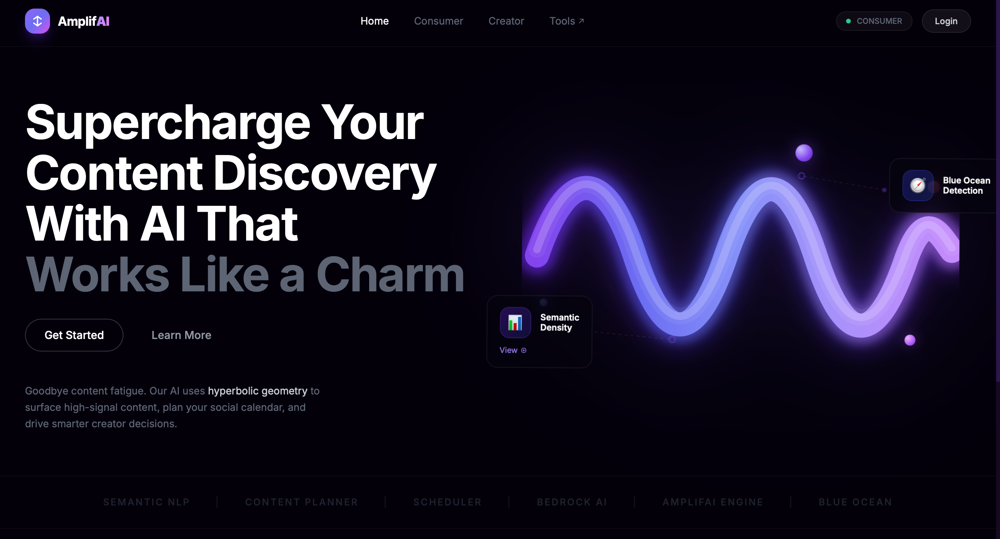

# AmplifAI — Hyperbolic Social Media Platform

AmplifAI is an AI-powered social media intelligence platform that leverages **hyperbolic geometry principles** to surface high-signal content and uncover **"Blue Ocean"** market opportunities for creators.

Unlike traditional platforms that optimize for purely viral engagement, AmplifAI focuses on **Semantic Density**—ranking content by its information value, rarity, and unique perspective.



---

## 🚀 Key Features

### For Content Consumers
- **Hyperbolic Search Engine**: Discover content based on "vibe" and sub-culture, not just keywords.
- **3D Hyperspace Visualization**: Explore content relationships in an immersive 3D web interface.
- **Signal-over-Noise Ranking**: Content is ranked by information density (0-100 score), filtering out clickbait.

### For Creators (AI Studio)
- **Market Gap Detection**: Identify underserved niches with high demand but low quality competition.
- **Blue Ocean Strategy**: Find "Vulnerable Giants" to disrupt and "Blue Ocean" opportunities to capture.
- **AI Content Tools**:
  - **Script Writer**: Generate high-retention video scripts with hook/value/CTA structure.
  - **Title A/B Lab**: Predict click-through rates for different title variations.
  - **Content Repurposer**: Transform videos into Twitter threads, LinkedIn posts, and more.

---

## 🧠 AWS Bedrock Integration

AmplifAI uses **AWS Bedrock** (Claude 3 Sonnet) to power its core intelligence engine. The integration (`app/services/bedrock_agent.py`) handles:

1.  **Intent Analysis**: Determines the "Hyperbolic Vector" (Sub-culture, Vibe, Target Audience) of search queries.
2.  **Semantic Density Scoring**: Analyzes video transcripts to score "Information Density" (0-100) and filter out "fluff".
3.  **Blue Ocean Detection**: Brainstorms underserved sub-niches based on market saturation data.
4.  **Content Generation**: Generates video scripts, summaries, and repurposes content for other platforms.

> **Note**: If AWS credentials are not provided in `.env`, the system automatically falls back to **Demo Mode**, using mock data for all AI features.

---

## 🛠️ Technology Stack

- **Frontend**: React 19, Vite, Tailwind CSS, Three.js (@react-three/fiber)
- **Backend**: FastAPI (Python 3.8+), Uvicorn
- **AI & ML**: AWS Bedrock (Claude 3 Sonnet), `yt-dlp` (Data Extraction), `textstat` (NLP)
- **Storage**: AWS S3 (Data "Pantry" & Caching)

---

## 📦 Installation

### Prerequisites
- Python 3.8+
- Node.js 18+
- AWS Account (Optional for Demo Mode)

### 1. Clone the Repository
```bash
git clone https://github.com/yourusername/amplifai.git
cd amplifai
```

### 2. Backend Setup
Create a virtual environment and install dependencies:

```bash
# Create virtual environment
python -m venv venv

# Activate venv (Mac/Linux)
source venv/bin/activate
# Activate venv (Windows)
# venv\Scripts\activate

# Install requirements
pip install -r requirements.txt
```

### 3. Frontend Setup
Navigate to the frontend directory and install dependencies:

```bash
cd frontend
npm install
```

---

## ⚙️ Configuration

Create a `.env` file in the root directory for backend configuration:

```env
# AWS Credentials (Optional - System runs in Demo Mode without them)
AWS_ACCESS_KEY_ID=your_access_key
AWS_SECRET_ACCESS_KEY=your_secret_key
AWS_REGION=us-east-1

# S3 Configuration
S3_BUCKET_NAME=hyperbolic-pantry
```

---

## ▶️ Running the Application

### Start the Backend (Port 8000)
From the root directory (make sure your venv is activated):

```bash
uvicorn app.main:app --reload
```
The API will be available at **http://localhost:8000**. API Docs at `http://localhost:8000/docs`.

### Start the Frontend (Port 5173)
In a separate terminal, navigate to `frontend/` and run:

```bash
npm run dev
```
The application will open at **http://localhost:5173**.

---

## 📂 Project Structure

```
amplifai/
├── app/                  # Backend Application
│   ├── core/             # Config & Models
│   ├── services/         # Business Logic (Ranking, Bedrock, Scraper)
│   └── main.py           # FastAPI Entry Point
├── frontend/             # React Application
│   ├── src/
│   │   ├── components/   # UI Components (Feed, 3D Space, Studio)
│   │   └── App.jsx       # Main Frontend Entry
├── requirements.txt      # Python Dependencies
├── design.md             # System Architecture & Design Doc
└── references.md         # Academic & Technical References
```

## 📄 License

This project is licensed under the MIT License - see the [LICENSE](LICENSE) file for details.

---

> **Note**: This is a research prototype. Scraped data from YouTube should be used responsibly and in accordance with their Terms of Service.
